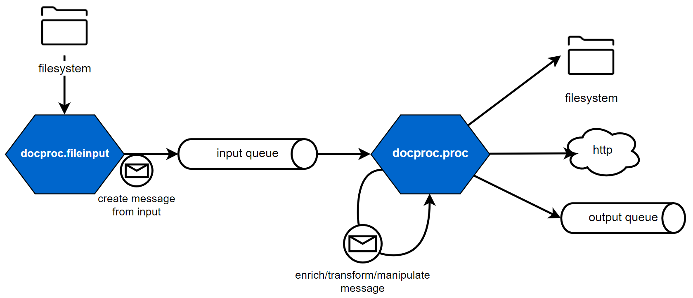
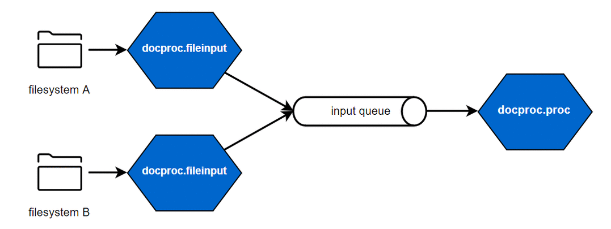

Welcome to docproc's documentation!
===================================

docproc is a simple content processing pipeline, which allows you to take
arbitrary input data and to transform it to create output data of any kind.

docproc consists of a set of applications, which allow you to perform different
transformation steps one after each other to achieve the desired result. Its
design is based on the functional steps to be taken to get useful output out of
raw data and can be described as follows:

#. consume input content
#. process content based on technical and functional requirements for the
   desired output
#. output the processed content as necessary, by e.g. sending it to a different
   host, writing it to disk or consuming the result via a queue.

   Simple docproc processing layout

To enable scalability, each of those functional steps can be handled by a
separate application of docproc. The applications are connected by message
queues, they read from and write to. This allows you to scale individual parts
or complete processing pipelines as required by your input and output scenarios.

   Scaled file input, processing and output scenarios

Features
--------

docproc provides a rich set of features to process content. Supported input
formats are

* CSV
* SAP RDI spool files

Content processors support

* validation and content enrichment using a simple to maintain rules engine
* text-driven transformation through golang's mighty templating packages, such
  as HTML, XML, JSON, plain text and others
* HTTP transfer, message queue and file-based output

Since docproc uses a simple JSON-based message format, applying your own
transformation routines via message queue consumers, HTTP receivers for file
listeners is easily accomplished.

.. toctree::
    :maxdepth: 1
    :caption: Contents:

    quickstart
    installing
    applications
    inputhandlers
    processors
    rulesengine
    docker
